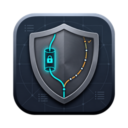
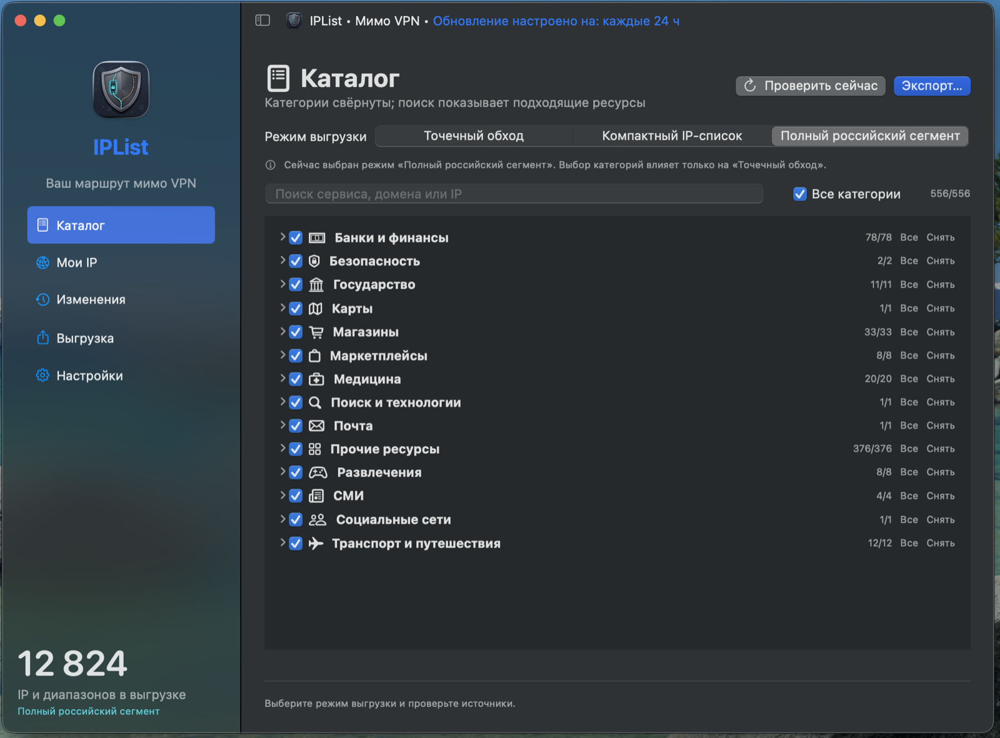
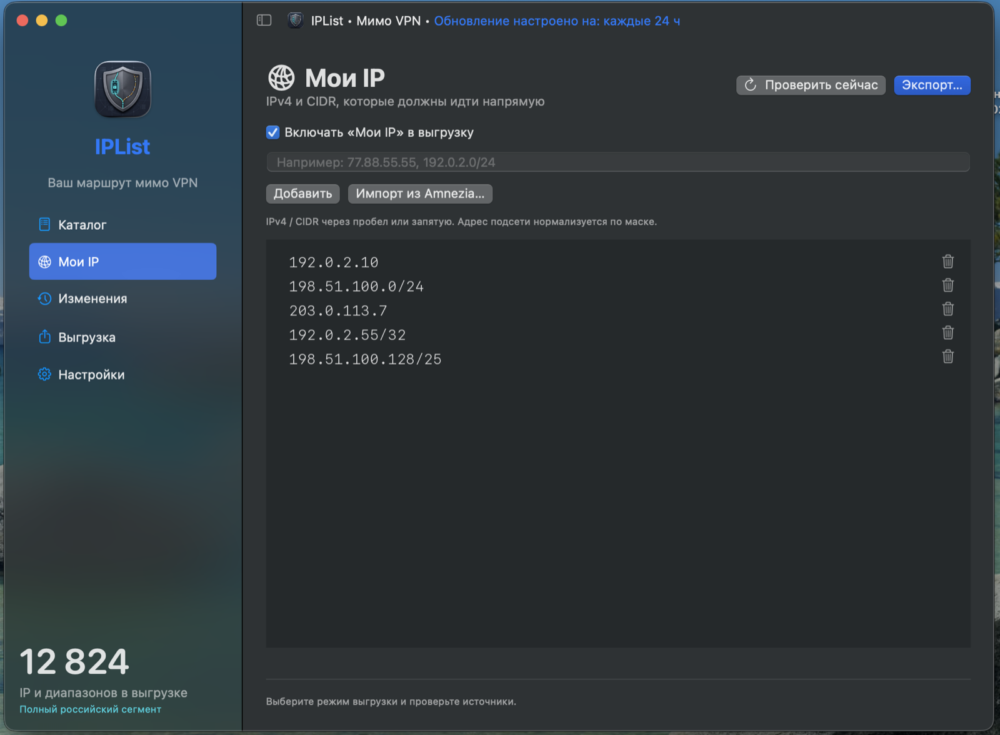
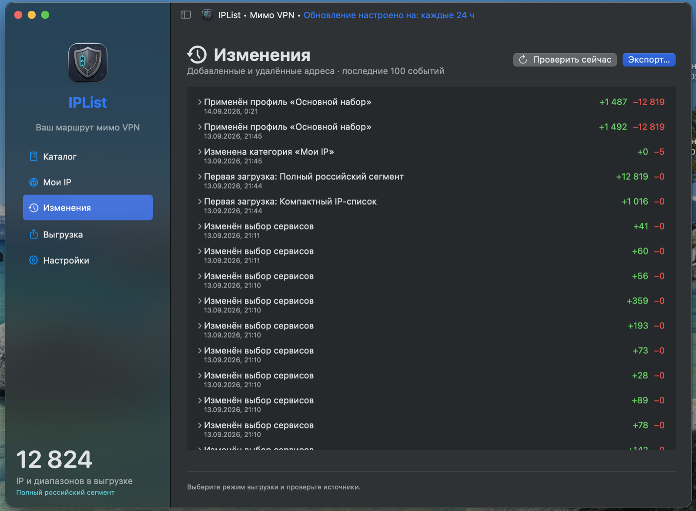
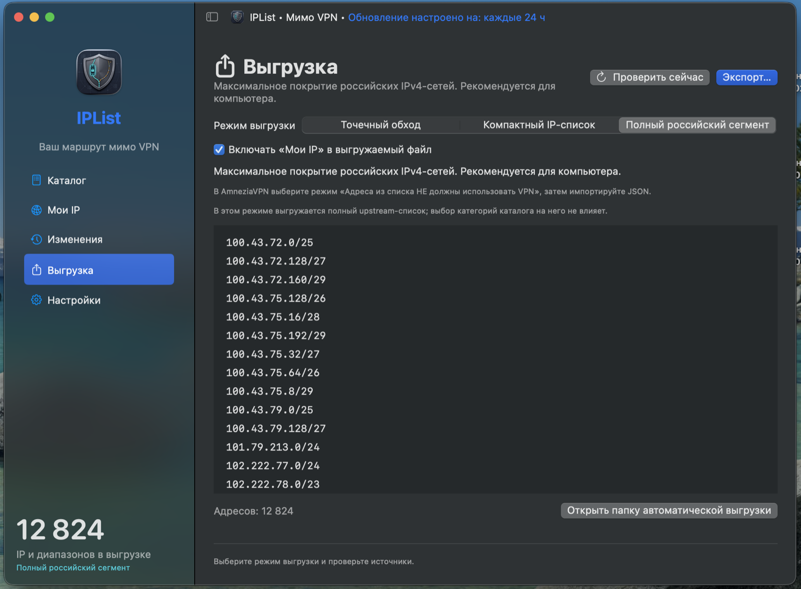
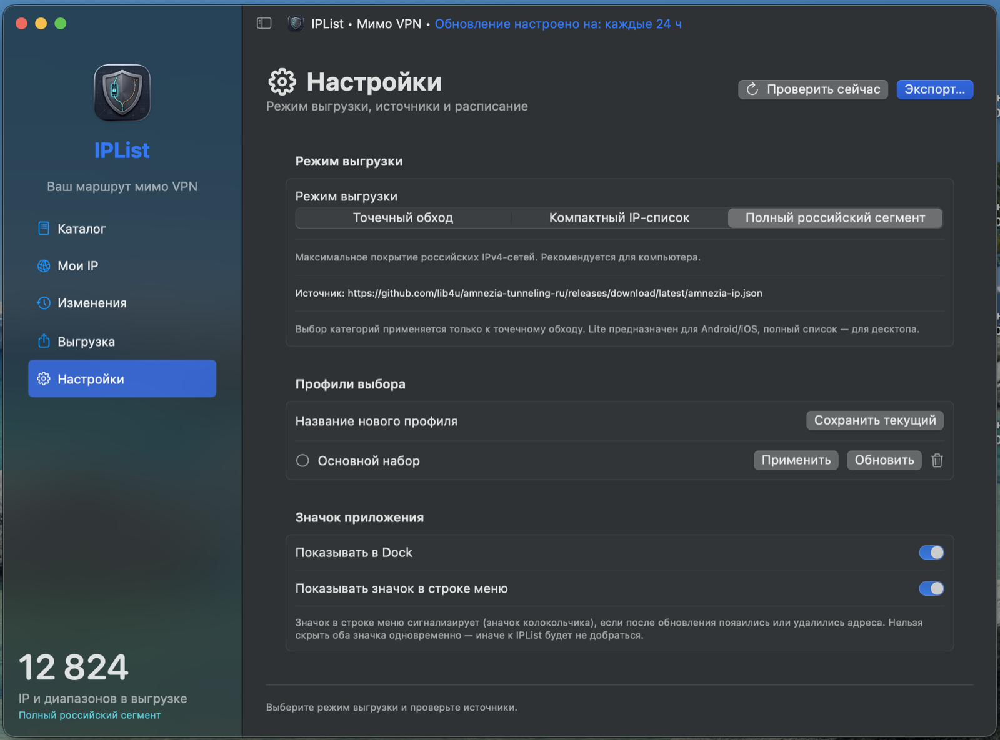

<p align="center">
  
</p>

<h1 align="center">IPList</h1>

<p align="center">
  <a href="README.md#русский">Русский</a> · <a href="README.md#english">English</a>
</p>

<p align="center">
  <a href="LICENSE"></a>
  
  
</p>

---

## Русский

**IPList** — нативное приложение для macOS 13+, которое ведёт актуальный список адресов для раздельного туннелирования (split tunneling) в **AmneziaVPN**. Приложение само скачивает публичные Amnezia-совместимые списки, даёт выбрать, какие категории сервисов должны идти в обход VPN, отслеживает изменения между проверками и экспортирует JSON именно в том формате, который понимает AmneziaVPN.

Сделано на основе списков [lib4u/amnezia-tunneling-ru](https://github.com/lib4u/amnezia-tunneling-ru). Поддерживаются все три варианта апстрима:

- `amnezia.json` — точечный обход по известным сервисам, с выбором категорий и сервисов прямо в IPList;
- `amnezia-ip-lite.json` — компактный список подсетей IPv4 для мобильных клиентов и более строгих условий;
- `amnezia-ip.json` — полный российский IPv4-сегмент для максимального покрытия на десктопе.

Свои адреса можно добавить в категорию «Мои IP» и по желанию включить в любой режим экспорта.

### Скриншоты

| Каталог | Мои IP |
|---|---|
|  |  |

| Изменения | Выгрузка |
|---|---|
|  |  |

| Настройки |
|---|
|  |

*IP-адреса на скриншоте «Мои IP» заменены на тестовые из RFC 5737 — на реальном экране там были бы ваши собственные адреса.*

### Возможности

- Ручное обновление и встроенное расписание — от 1 до 720 часов.
- Страница диагностики источников: HTTP-статус, время ответа, число адресов, точный URL, на котором произошла ошибка.
- Повтор запроса и переключение на официальный резервный URL между GitHub Releases и `raw.githubusercontent.com`.
- Дерево категорий (свёрнуто по умолчанию), быстрый выбор всех/ничего, поиск, выбор отдельных сервисов — у каждой категории своя иконка.
- Именованные профили: сохраняют выбранные сервисы, режим экспорта и флаг «Мои IP».
- Импорт уже существующего экспорта Amnezia для ручного выбора адресов.
- История изменений — какие адреса добавились/пропали между успешными проверками.
- Автоматический локальный экспорт в `~/Library/Application Support/IPList/amnezia-direct.json`.
- Присутствие в строке меню, чтобы расписание продолжало работать при закрытом окне.
- Настраиваемая видимость значка: можно скрыть из Dock, оставив только строку меню, или наоборот. Значок в строке меню сам показывает колокольчик, если после обновления появились или пропали адреса — оба значка одновременно скрыть нельзя, иначе до приложения будет не добраться.
- Верхняя панель окна показывает текущее расписание обновления одним взглядом.

### Установка и запуск

**Готовый DMG:** [скачать IPList-1.2.1.dmg](https://github.com/AlB4k/IPList/releases/latest/download/IPList-1.2.1.dmg) со страницы [Releases](https://github.com/AlB4k/IPList/releases/latest). DMG содержит `IPList.app`, ярлык на `/Applications` и инструкцию по первому запуску.

Автообновления в приложении нет: если уже установлена более ранняя версия, для перехода на новую скачайте свежий DMG и перетащите `IPList.app` в `/Applications` поверх старого — настройки и списки в `~/Library/Application Support/IPList/` сохранятся.

Либо собрать локальный бандл приложения из исходников:

```sh
./scripts/build-app.sh
open dist/IPList.app
```

Готовое приложение подписано ad-hoc (не через Apple Developer ID) и предназначено для локального использования на этом Mac — оно не нотаризовано для публичного распространения.

Для повседневного использования перенесите `IPList.app` в `/Applications` и добавьте в «Системные настройки → Основные → Элементы входа», если расписание должно продолжать работать после перезагрузки.

**Установка из DMG на «чистом» Mac.** При первом запуске macOS Gatekeeper покажет предупреждение «не удаётся проверить разработчика» — это ожидаемо для ad-hoc подписи без Developer ID. Правой кнопкой по IPList.app → «Открыть» → подтвердить во всплывающем окне, либо разрешить в «Настройки → Конфиденциальность и безопасность». Делать это нужно только один раз.

### Как пользоваться

1. Откройте IPList и нажмите «Проверить сейчас».
2. На вкладке «Каталог» выберите режим выгрузки и отметьте нужные категории или отдельные сервисы. По умолчанию выбраны все категории, группы свёрнуты.
3. На вкладке «Мои IP» добавьте IPv4/CIDR вручную или импортируйте существующий экспорт Amnezia. Импортированные адреса показываются для выбора и не включаются автоматически.
4. На вкладке «Выгрузка» решите, включать ли «Мои IP» в файл, и сохраните JSON.
5. В AmneziaVPN откройте раздельное туннелирование по сайтам, выберите режим «адреса из списка НЕ используют VPN» и импортируйте сохранённый JSON.

При повторном импорте в AmneziaVPN проверьте, как клиент обходится с уже загруженными правилами: IPList экспортирует актуальный список целиком, но AmneziaVPN может объединять его со старыми правилами вместо замены — это зависит от версии клиента.

### Режимы экспорта

Точечный режим использует `amnezia.json` и учитывает выбор категорий/сервисов в IPList — лучший вариант, когда VPN должны обходить только конкретные известные сервисы.

Компактный и полный режимы выгружают весь upstream-список диапазонов целиком. Формат источника не гарантирует надёжного соответствия «подсеть → категория сервиса», поэтому выбор категорий сознательно ограничен точечным режимом. Ручные адреса можно включать и в компактный, и в полный режим.

IPv6 не экспортируется. Домены без IPv4-адреса в источнике видны в каталоге, только если у апстрима нет для них IP.

### Хранение данных

Локальное состояние хранится здесь:

```text
~/Library/Application Support/IPList/
```

В этой папке:

- `state.json` — загруженный каталог, выбор, профили, ручные адреса, настройки расписания, кэш компактного/полного списков, недавняя история;
- `state-before-v1.1.json` — разовая резервная копия, создаётся при первом запуске после обновления до версии 1.1;
- `amnezia-direct.json` — автоматически сохранённый экспорт для текущего режима.

Введённые вручную IP-адреса хранятся только локально и никуда, кроме этой папки на вашем компьютере, не отправляются.

### Источники

URL по умолчанию:

```text
https://github.com/lib4u/amnezia-tunneling-ru/releases/download/latest/amnezia.json
https://github.com/lib4u/amnezia-tunneling-ru/releases/download/latest/amnezia-ip-lite.json
https://github.com/lib4u/amnezia-tunneling-ru/releases/download/latest/amnezia-ip.json
https://raw.githubusercontent.com/v2fly/domain-list-community/master/data/
```

Приложение также понимает совместимые кастомные HTTPS-адреса в том же формате JSON.

Названия категорий берутся из файлов `v2fly/domain-list-community`, включая цепочки `include`, записи `full`, `domain` и обычные домены. Правила `regexp` и `keyword` не превращаются в придуманные адреса — такие записи пропускаются.

### Разработка

Нужно:

- macOS 13 или новее для запуска приложения;
- Swift Command Line Tools или Xcode с поддержкой Swift 5.9;
- сетевой доступ для проверки живых источников.

Сборка и тесты:

```sh
./scripts/test.sh
./scripts/build-app.sh
```

Дополнительный тест на реальных апстрим-источниках:

```sh
IPLIST_LIVE_TEST=1 ./scripts/test.sh
```

Тестовый набор — самостоятельный исполняемый файл на Swift, без зависимости от XCTest. Он проверяет нормализацию адресов, импорт/экспорт, выбор по умолчанию, миграцию состояния, профили, повтор запросов, резервные URL, искусственные таймауты, обработку невалидного JSON, диагностику и все три режима экспорта.

### Лицензия

Apache License 2.0 — см. [LICENSE](LICENSE). Правообладатель: AlB4k, 2026.

### Стороннее ПО и данные

Заметки о сторонних источниках — в [THIRD_PARTY_NOTICES.md](THIRD_PARTY_NOTICES.md). Репозиторий не содержит вендоренных копий upstream-списков Amnezia.

### Безопасность и приватность

IPList скачивает публичные файлы списков по настроенным URL и сохраняет локальные JSON-файлы. Приложение не управляет AmneziaVPN напрямую и не изменяет настройки VPN.

Локальное состояние хранится под текущей учётной записью пользователя macOS. Не коммитьте файлы из `~/Library/Application Support/IPList/` — там могут быть личные вручную добавленные IP-адреса.

---

## English

**IPList** is a native SwiftUI app for macOS 13+ that keeps an AmneziaVPN split tunneling bypass list up to date. It downloads public Amnezia-compatible lists, lets you choose which service categories should bypass VPN, tracks changes between checks, and exports JSON in the format AmneziaVPN can import.

The app was built around [lib4u/amnezia-tunneling-ru](https://github.com/lib4u/amnezia-tunneling-ru). It supports all three current upstream list variants:

- `amnezia.json`: targeted bypass for known services, with category and service selection inside IPList.
- `amnezia-ip-lite.json`: compact IPv4 subnet list intended for mobile clients and stricter environments.
- `amnezia-ip.json`: full Russian IPv4 segment list for maximum desktop coverage.

Manual addresses can be added in the "My IP" category and optionally included in any export mode.

### Screenshots

| Catalog | My IP |
|---|---|
|  |  |

| History | Export |
|---|---|
|  |  |

| Settings |
|---|
|  |

*The IP addresses in the "My IP" screenshot are replaced with RFC 5737 test addresses — the real screen would show your own entries.*

### Features

- Manual update button and in-app schedule from 1 to 720 hours.
- Source diagnostics page with HTTP status, response time, parsed address count, and exact failing URL.
- Retry and official fallback handling between GitHub Releases and `raw.githubusercontent.com`.
- Category tree with collapsed groups by default, global select-all, search, per-service selection, and a distinct icon per category.
- Named profiles for saving and restoring selected services, export mode, and the "My IP" inclusion flag.
- Import of an existing Amnezia JSON export for manual address selection.
- Change history for added and removed addresses between successful checks.
- Automatic local export to `~/Library/Application Support/IPList/amnezia-direct.json`.
- Menu bar presence, so scheduled checks can continue while the main window is closed.
- Configurable icon visibility: hide the Dock icon and keep only the menu bar item, or the other way around. The menu bar icon itself switches to a bell glyph when addresses were added or removed after a refresh. Both icons cannot be hidden at the same time, so there is always a way back into the app.
- The window's toolbar shows the current update schedule at a glance.

### Install And Run

**Ready-made DMG:** [download IPList-1.2.1.dmg](https://github.com/AlB4k/IPList/releases/latest/download/IPList-1.2.1.dmg) from the [Releases](https://github.com/AlB4k/IPList/releases/latest) page. The DMG contains `IPList.app`, an `/Applications` shortcut, and a first-launch note.

There is no in-app auto-update: if an earlier version is already installed, download the new DMG and drag `IPList.app` over the old one in `/Applications` — settings and lists under `~/Library/Application Support/IPList/` are preserved.

Or build a local app bundle from source:

```sh
./scripts/build-app.sh
open dist/IPList.app
```

The produced app is ad-hoc signed and intended for local use on this Mac. It is not notarized for public distribution.

For regular use, move `IPList.app` to `/Applications` and add it to "System Settings -> General -> Login Items" if scheduled checks should resume after reboot.

**Installing a DMG on a clean Mac.** macOS Gatekeeper will warn that the developer cannot be verified on first launch — expected for an ad-hoc signature without a Developer ID. Right-click IPList.app -> "Open" -> confirm in the dialog, or allow it under "System Settings -> Privacy & Security". This is only needed once.

### Using The App

1. Open IPList and click "Check now".
2. In "Catalog", choose the export mode and select categories or individual services. All categories are selected by default, and groups are collapsed by default.
3. In "My IP", add IPv4/CIDR entries manually or import an existing Amnezia JSON file. Imported entries are shown for selection and are not enabled silently.
4. In "Export", choose whether manual addresses should be included, then save the JSON file.
5. In AmneziaVPN, open site split tunneling, choose the mode where addresses from the list should not use VPN, and import the exported JSON.

When re-importing into AmneziaVPN, check how the client handles previous entries. IPList exports the current desired list, but AmneziaVPN may merge with old imported rules instead of replacing them, depending on the client version and workflow.

### Export Modes

The targeted mode uses `amnezia.json` and applies the category/service selection from IPList. It is the best mode when only known services should bypass VPN.

The Lite and Full modes export the upstream IP range files as whole datasets. Their source format does not preserve a reliable one-to-one relationship between subnet and service category, so category selection is intentionally limited to the targeted mode. Manual addresses can still be included in Lite and Full exports.

IPv6 is not exported. Domain-only entries are visible in the catalog only when the upstream source does not provide an IPv4 address for them.

### Data Storage

IPList stores its local state in:

```text
~/Library/Application Support/IPList/
```

Files in that directory include:

- `state.json`: downloaded catalog, selections, profiles, manual addresses, schedule settings, cached Lite/Full lists, and recent history.
- `state-before-v1.1.json`: one-time backup created on first launch after upgrading to version 1.1.
- `amnezia-direct.json`: automatically saved export for the currently selected mode.

User-provided manual IP addresses are stored only locally. They are not sent to upstream list sources.

### Sources

Default source URLs:

```text
https://github.com/lib4u/amnezia-tunneling-ru/releases/download/latest/amnezia.json
https://github.com/lib4u/amnezia-tunneling-ru/releases/download/latest/amnezia-ip-lite.json
https://github.com/lib4u/amnezia-tunneling-ru/releases/download/latest/amnezia-ip.json
https://raw.githubusercontent.com/v2fly/domain-list-community/master/data/
```

The app also understands compatible custom HTTPS URLs in the same JSON shape.

Category names are derived from files in `v2fly/domain-list-community`, including include chains, `full`, `domain`, and plain domain entries. `regexp` and `keyword` rules are not converted into invented addresses.

### Development

Requirements:

- macOS 13 or newer for running the app.
- Swift Command Line Tools or Xcode with Swift 5.9 support.
- Network access for live source checks.

Build and test:

```sh
./scripts/test.sh
./scripts/build-app.sh
```

Optional live test against real upstream sources:

```sh
IPLIST_LIVE_TEST=1 ./scripts/test.sh
```

The test harness is a standalone Swift executable and does not require XCTest. It covers address normalization, import/export behavior, default selection, migration, profiles, retry logic, fallback URLs, artificial timeout behavior, invalid JSON handling, diagnostics, and the three export modes.

### License

Apache License 2.0 — see [LICENSE](LICENSE). Copyright AlB4k, 2026.

### Third-Party Software And Data

Third-party source notes are documented in [THIRD_PARTY_NOTICES.md](THIRD_PARTY_NOTICES.md). The repository does not include vendored copies of upstream Amnezia list files.

### Security And Privacy Notes

IPList downloads public list files from the configured URLs and writes local JSON files. It does not control AmneziaVPN directly and does not modify VPN settings.

The app stores local state under the current macOS user account. Do not commit files from `~/Library/Application Support/IPList/`; they may contain personal manual IP entries.
